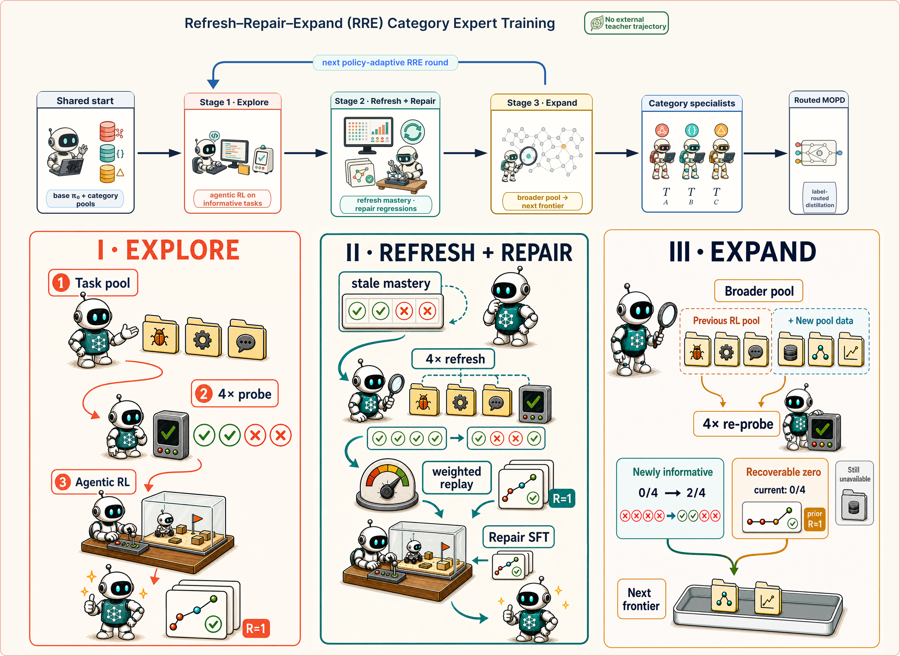
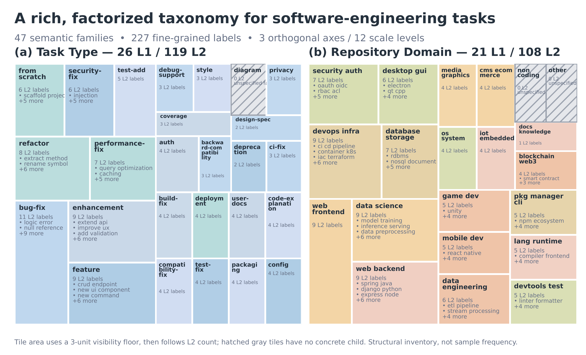

# Agentic Bigbang

**Data, evaluation, and post-training for agents that work.**

Agentic Bigbang brings together our research on agentic data synthesis,
data processing, evaluation, and post-training across two domains:

- **SWE:** agents for repository-level software engineering, from task
  organization and expert training to single-policy integration.
- **Cowork:** agents for knowledge work and productivity tasks, including
  document-grounded slide generation and task-specific evaluation.

This is a shared research repository. Each work has its own documentation,
artifacts, and release scope; reusable tools live alongside the paper packages.

| Domain | Work or component | Entry point |
| --- | --- | --- |
| SWE | **RRE–MOPD:** category-aware expert development and policy integration | [📄 Paper](https://arxiv.org/abs/2609.23377) · [Research artifacts](papers/rre_mopd/README.md) · [🤗 Model](https://huggingface.co/Logics-MLLM/Logics-SWE-Qwen3.6-27B) · [🤗 Data & environments](https://huggingface.co/datasets/Logics-MLLM/Logics-SWE-Env-2.5K) · [Model card](papers/rre_mopd/MODEL_CARD.md) |
| SWE | **SWE Labeler:** hierarchical task and trajectory annotation | [Code and usage](swe_labeler/README.md) |
| Cowork | **PPTSynth:** document-grounded slide-task and rubric synthesis | [Code and usage](pptsynth/README.md) |

## SWE Research: RRE-MOPD

### One to More, More to One: Category-Aware Iterative Expert Training for Software Engineering Agents

[Paper](https://arxiv.org/abs/2609.23377) ·
[Artifacts & reproduction](papers/rre_mopd/README.md) ·
[SWE Labeler](swe_labeler/README.md) ·
[Model card](papers/rre_mopd/MODEL_CARD.md) ·
[Figures & supporting data](papers/rre_mopd/results/figures/README.md)

**TL;DR:** Develop category specialists through **Refresh–Repair–Expand
(RRE)**, then consolidate their behaviors into **one deployable agent** with
multi-teacher on-policy distillation (**MOPD**).

Repository-level software engineering spans heterogeneous tasks. Under pooled
reinforcement learning, gains in one category can coincide with regressions in
another: aggregate resolution can hide this **category see-saw**. Simply
splitting the training data by category does not guarantee stronger experts.
Our work therefore studies how to **develop and integrate** category experts,
rather than treating category splitting itself as a demonstrated improvement.

#### How it works

1. **Organize tasks with SWE Labeler.** Evidence-grounded, multi-axis labels
   organize executable tasks into three repository-domain categories and
   support category-level training and analysis.
2. **Develop experts with RRE.** Starting from the same base model, category
   experts alternate long-horizon Agentic-miniRL with mastery refreshes,
   supervised repair using their own verified successful trajectories, and
   task-pool expansion for further RL.
3. **Integrate with MOPD.** A student generates its own trajectories and receives
   label-routed supervision from the category experts, with reference-anchored
   extrapolation. The resulting policy requires neither category routing nor
   multiple expert models at inference time.

*RRE develops the category experts; MOPD distills them into a single student.
Integration is on-policy distillation, not arithmetic averaging of weights.*

Expert training and policy integration use no external model to supply
solution trajectories or action targets. This statement does not exclude
the use of a labeling model for task annotation.

#### SWE Labeler: from task evidence to training categories

**SWE Labeler** is a reusable annotation tool for both repository-level task
instances and agent interaction trajectories. Its evidence-grounded taxonomy
describes **what a task changes**, **the repository's engineering domain**,
and **the scale of the work**:

- **Task Type:** 26 L1 families and 119 fine-grained L2 labels.
- **Repository Domain:** 21 L1 families and 108 fine-grained L2 labels.
- **Three scale axes:** modification scope, cognitive complexity, and
  estimated resolution time, each with four levels.

*The paper's taxonomy atlas shows the label inventory, not dataset frequencies.
Click the image for the original vector PDF.*

In RRE–MOPD, a fixed map groups repository-Domain labels into the A/B/C
categories used for expert training, teacher routing, and category-level
evaluation. Task Type, fine-grained labels, and scale annotations remain
available for data profiling and training diagnostics. The labeler can also
be used independently of the RRE–MOPD training pipeline.

[Code & quick start](swe_labeler/README.md) ·
[Taxonomy definitions](swe_labeler/definition/) ·
[Benchmark annotations](papers/rre_mopd/data/labeling/README.md)

#### Main results

Task resolution (%) is reported as **mean ± population standard deviation
over three evaluation rounds**, with one candidate patch per task per round.

| Model | Pro-618 | SWE-bench Multilingual |
| --- | ---: | ---: |
| Base | 52.64 ± 0.28 | 56.22 ± 0.68 |
| Pooled RL | 55.50 ± 0.46 | 55.56 ± 0.83 |
| Balanced RL | 55.34 ± 0.92 | 57.00 ± 1.19 |
| **RRE–MOPD (Logics-SWE-Qwen3.6-27B)** | **58.04 ± 0.20** | **59.00 ± 0.47** |

The final policy improves mean resolution over pooled / balanced RL by
**2.54 / 2.70 percentage points on Pro-618** and **3.44 / 2.00 points on
SWE-bench Multilingual**. It also achieves higher mean resolution in each
A/B/C category than both joint-training baselines on both benchmarks.

Pro-618 is a documented **618-task subset** of SWE-bench Pro, not the full
benchmark. Multilingual results cover all **300 tasks**. Scores describe the
complete model-and-agent setups; see the [model card](papers/rre_mopd/MODEL_CARD.md)
for evaluation scope and limitations, and the
[aggregate results](papers/rre_mopd/results/aggregate/evaluation_model_scores.csv)
for the underlying table.

#### Explore the work

- **Download the model:** [Logics-SWE-Qwen3.6-27B on Hugging Face](https://huggingface.co/Logics-MLLM/Logics-SWE-Qwen3.6-27B),
  the released single policy trained with RRE–MOPD.
- **Use the released instances and environments:** [Logics-SWE-Env-2.5K on Hugging Face](https://huggingface.co/datasets/Logics-MLLM/Logics-SWE-Env-2.5K)
  provides 2,553 instance records and matching container references; see the
  [download and execution guide](papers/rre_mopd/instance_environment/README.md).
- **Inspect the experiments:** [training manifests and evaluation metadata](papers/rre_mopd/data/manifests/README.md),
  [per-task results](papers/rre_mopd/results/per_instance/), and
  [training and evaluation configurations](papers/rre_mopd/configs/README.md).
- **Reproduce the analysis:** [validation and plotting instructions](papers/rre_mopd/README.md#run-locally),
  [statistical reproduction](papers/rre_mopd/scripts/STATISTICS.md), and
  [figure index](papers/rre_mopd/results/figures/README.md).
- **Use the labeling tools:** [SWE Labeler](swe_labeler/README.md),
  [taxonomy definitions](papers/rre_mopd/data/taxonomy/README.md), and
  [benchmark annotations](papers/rre_mopd/data/labeling/README.md).

## Cowork Research

The Cowork direction focuses on agents for knowledge work and productivity
tasks. The current tool entry point is **[PPTSynth](pptsynth/README.md)**, which
creates slide-generation tasks and instance-specific binary rubrics from
source PDFs, using profiles for different document types and languages.

PPTSynth is currently a **code-only package**: source documents, generated
tasks, and execution logs are not included. See its
[data policy](pptsynth/DATA_POLICY.md) for input and output boundaries.
Further Cowork research descriptions and paper artifacts will be added here
as they become available.

## Release Status

- **In this repository:** SWE Labeler and PPTSynth code, plus the RRE–MOPD
  research package containing anonymous training manifests, benchmark data
  and results, configuration specifications, analysis scripts, and figures.
- **Released model:** [Logics-SWE-Qwen3.6-27B](https://huggingface.co/Logics-MLLM/Logics-SWE-Qwen3.6-27B)
  is available on Hugging Face under Apache-2.0.
- **Released data and environments:** [Logics-SWE-Env-2.5K](https://huggingface.co/datasets/Logics-MLLM/Logics-SWE-Env-2.5K)
  provides 2,553 instance records with matching environment-image references
  and a documented execution protocol.
- **Published paper:** [One to More, More to One: Category-Aware Iterative
  Expert Training for Software Engineering Agents](https://arxiv.org/abs/2609.23377).
- **Not included:** complete training data and execution trajectories.
  Anonymous manifests describe training membership; they do not provide
  the underlying task content or all inputs needed to repeat training.

See the [RRE–MOPD package](papers/rre_mopd/README.md),
[model card](papers/rre_mopd/MODEL_CARD.md), and each tool's documentation for
the scope of individual releases.

## License

Licensing is component-specific: [SWE Labeler](swe_labeler/LICENSE) and
[PPTSynth](pptsynth/LICENSE) include Apache-2.0 licenses. See the
[SWE Labeler license scope](swe_labeler/LICENSE_STATUS.md) for its coverage
and third-party exceptions.

These code licenses do not automatically license other research artifacts,
third-party datasets, or model weights. Consult the applicable component and
artifact notices. The released [Logics-SWE-Qwen3.6-27B model](https://huggingface.co/Logics-MLLM/Logics-SWE-Qwen3.6-27B)
is licensed under Apache-2.0.
