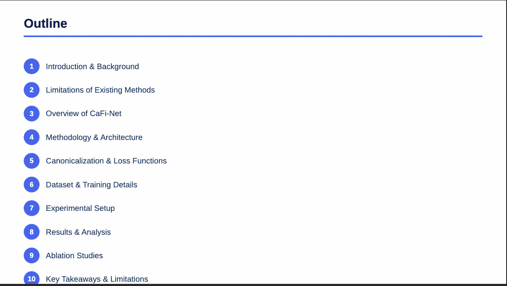
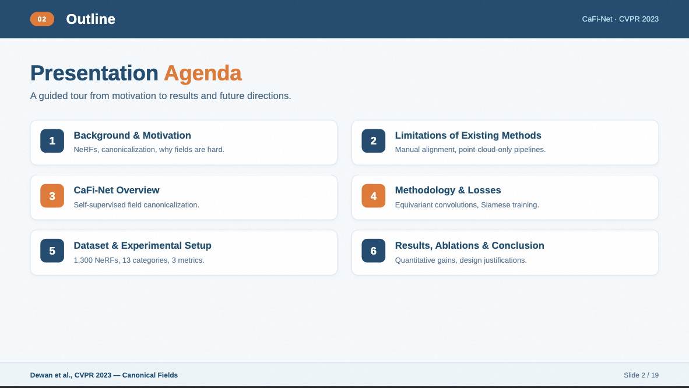
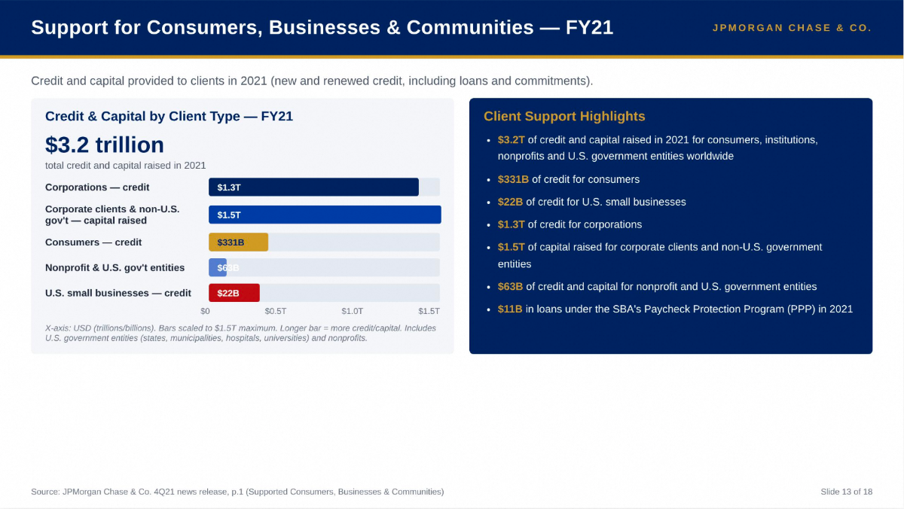
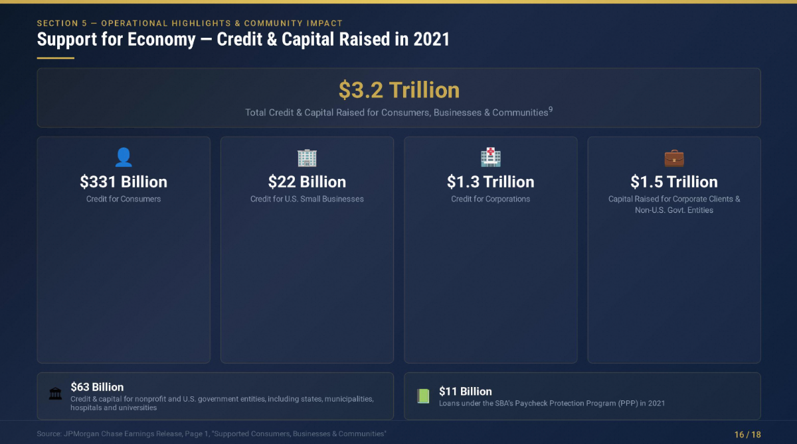
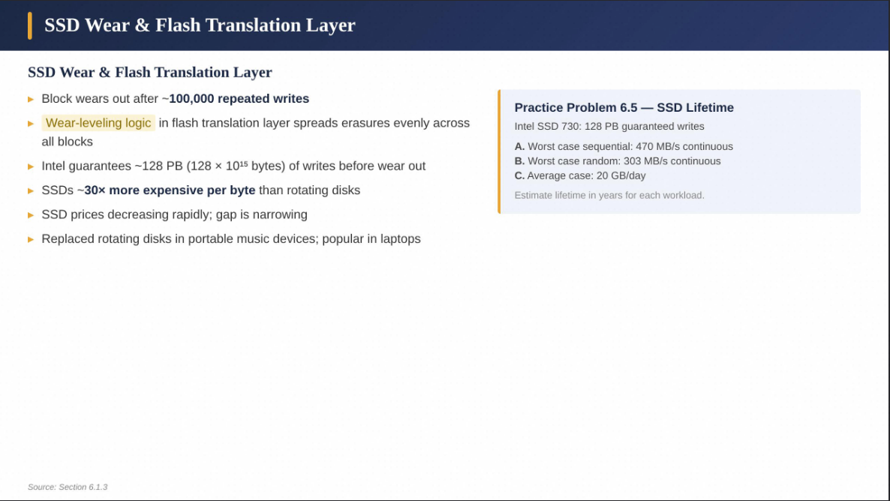
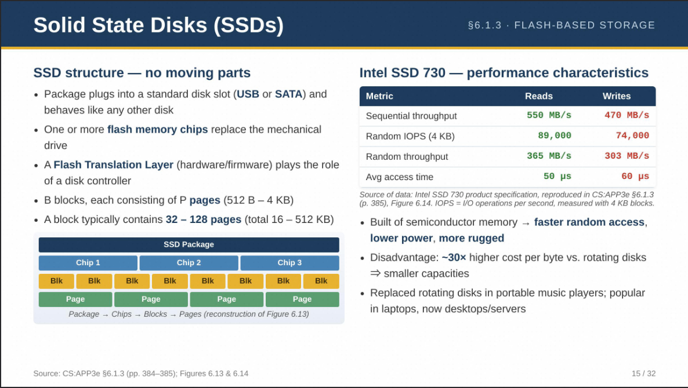
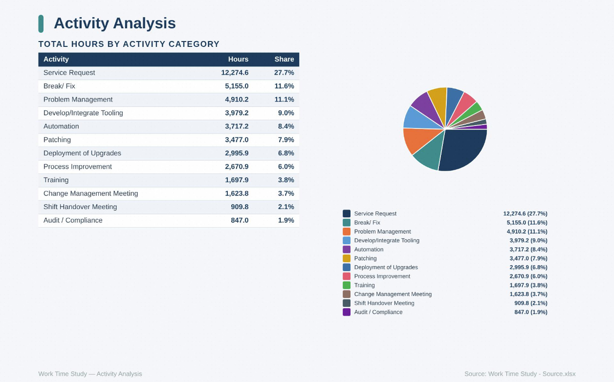
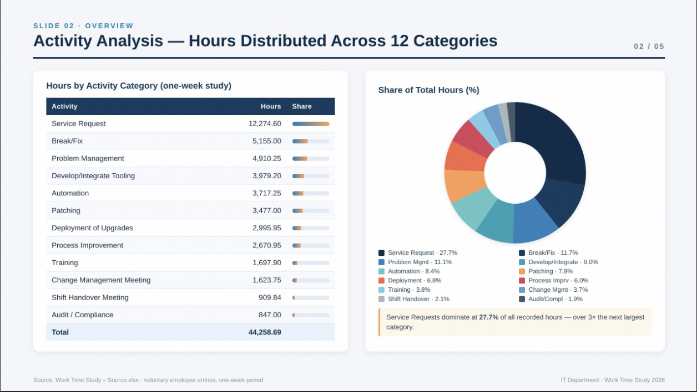

# Towards Presentation Intelligence

**High-Quality Data Synthesis, Guided Distillation and Verifiable Rewards**

> Technical report under review. **arXiv preprint coming very soon.**

[Project homepage](../../README.md#cowork-research) ·
[Released models](#released-models) ·
[PPTSynth code](../../pptsynth/README.md)

High-quality slide generation needs more than a fluent language model. An agent
must understand source documents, plan a deck, preserve important facts, and
produce readable slides with coherent visual design. Logics-PPT studies this
full presentation-generation task through three connected stages: grounded
data synthesis, guided trajectory distillation, and reinforcement learning
from verifiable visual feedback.

*The diagram is an explanatory illustration. Its labels and connectors are
editable in the [SVG source](figures/presentation-intelligence-overview.svg).*

## Research approach

### 1. Grounded task and rubric synthesis

A source document is profiled into an evidence-rich card. The task instruction
specifies what the deck should cover, while an instance-specific binary rubric
checks **material completeness** and **factual correctness** separately. The
pipeline audits the task and rubric, then conditionally revises weak rubric
items and checks them again. This makes the supervision more specific to the
document and reduces leakage of answers into the task itself.

The released [PPTSynth](../../pptsynth/README.md) package implements this
task-and-rubric synthesis pathway for English and Chinese academic material,
English finance/economics reports, and Chinese general-domain documents. It
does not include the source documents, synthesized dataset, or the training
pipeline used for the model checkpoints.

### 2. Guided distillation

The study treats presentation construction as a long agentic trajectory rather
than a single text response. More explicit source-grounding and design guidance
helps teachers produce useful trajectories. Complementary teacher behaviors
are mixed, and generated decks with rendering or layout failures are filtered
before supervised fine-tuning (SFT). Dense 27B and MoE 35B-A3B backbones are
trained as separate students.

### 3. Verifiable visual rewards

After SFT, slide aesthetics are refined with group-relative reinforcement
learning. The study renders HTML slides in a browser and computes five
inspectable reward components on the visible result:

| Reward | What it checks |
| --- | --- |
| Aspect ratio | Whether the rendered slide keeps the intended presentation canvas |
| Whitespace | Whether content fills the slide without excessive empty regions |
| Element collision | Whether meaningful elements overlap or cross boundaries |
| Visual balance | How content is distributed across the slide |
| Font readability | Whether text remains legible at presentation size |

These rewards target visual quality. They do not directly measure whether the
slide accurately represents every claim in its source document. The paper
studies both task-difficulty and aesthetic-difficulty sampling for RL.

## Representative generated slides

The following images are extracted from the technical report's Figures 1 and
2. Each before/after pair comes from one representative case in that report.
They illustrate observed changes, not a quantitative success rate.

### Before and after SFT

| Case | Before SFT | After SFT |
| --- | --- | --- |
| Layout hierarchy |  |  |
| Turning text into a visualization |  |  |
| Structural diversity |  |  |

### Before and after RL

| Case | Before RL | After RL |
| --- | --- | --- |
| Element collision |  |  |
| Whitespace and font readability |  |  |
| Aspect ratio and visual balance |  |  |

## Released models

The four checkpoints are available on both Hugging Face and ModelScope. They
are trained for generating **one HTML file per slide** within an agentic
presentation workflow. The model cards include minimal inference examples;
full deck generation also needs task instructions, file/tool access, and a
browser-rendering loop.

| Backbone | Checkpoint | Hugging Face | ModelScope |
| --- | --- | --- | --- |
| Qwen3.6-35B-A3B, MoE | RL | [Model card and weights](https://huggingface.co/Logics-MLLM/Logics-PPT-Qwen3.6-35B-A3B-RL) | [Model card and weights](https://www.modelscope.ai/models/Alibaba-DT/Logics-PPT-Qwen-3.6-35B-A3B-RL) |
| Qwen3.6-35B-A3B, MoE | SFT | [Model card and weights](https://huggingface.co/Logics-MLLM/Logics-PPT-Qwen3.6-35B-A3B-SFT) | [Model card and weights](https://www.modelscope.ai/models/Alibaba-DT/Logics-PPT-Qwen-3.6-35B-A3B-SFT) |
| Qwen3.6-27B, dense | RL | [Model card and weights](https://huggingface.co/Logics-MLLM/Logics-PPT-Qwen3.6-27B-RL) | [Model card and weights](https://www.modelscope.ai/models/Alibaba-DT/Logics-PPT-Qwen3.6-27B-RL) |
| Qwen3.6-27B, dense | SFT | [Model card and weights](https://huggingface.co/Logics-MLLM/Logics-PPT-Qwen3.6-27B-SFT) | [Model card and weights](https://www.modelscope.ai/models/Alibaba-DT/Logics-PPT-Qwen3.6-27B-SFT) |

The SFT and RL variants serve different research questions. The RL stage
optimizes the five visual rewards; readers interested in overall benchmark
quality should consult the corresponding model card and eventual public paper
before choosing a checkpoint.

## What is available here

- [PPTSynth](../../pptsynth/README.md): source-grounded slide-task and rubric
  synthesis code, with installation and CLI examples.
- This research overview, a method illustration, and representative slide
  examples from the technical report.
- External model releases through the links above.

The PDF sources, generated training instances, complete teacher trajectories,
and unpublished training or reward services are not part of this repository.
Review [PPTSynth's data policy](../../pptsynth/DATA_POLICY.md) before processing
or sharing source material.

## Figure provenance

The before/after slides above are extracted from Figures 1 and 2 of the local
technical report without visual regeneration. The method overview uses three
AI-generated illustration components; its scientific labels, arrows, and
captions were composed separately as editable SVG elements. See the
[figure source notes](figures/README.md) for the prompts and rendering details.
